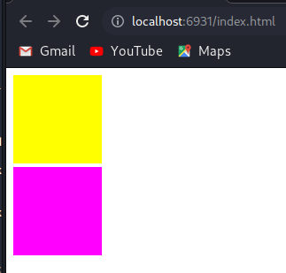

# Welcome to wasm_hello_world_cpp_multiple_webgl

Back to [home](../readme.md)

This is an extension of "../wasm_hello_world_cpp_multiple_webgl" in order to handle multiple windows/canvases (i.e. windows in nodejs and canvases in browser).

There are four examples in this directory.

* **index.html** and **index.js** run wasm with webgl in a browser.
* **nodewebgl.js** runs a simple example of webgl in a native windows using nodejs plus webgl-raub and glfw-raub
* **wasmwebgl.js** runs wasm with webgl in a native windows using nodejs plus webgl-raub and glfw-raub <-- Not working
* **wasmglfw.html** and **wasmglfw.js** run wasm with glfw in a browser. But it is limited to one single windows

The browser version is based in this [blog](https://blog.feather.systems/WebGL.html), also found in [Github](https://github.com/AO-Design-Inc/webGL-with-emscripten).

In order to create wasm, it needs [Emscripten SDK (emsdk)](../readme.md#Installing-the-C-Emscripten-SDK)

After emsdk is installed, in order to use it, activate PATH and other environment variables in the current terminal:

```bash
source ../../../emsdk/emsdk_env.sh
```

## WASM file creation and execution

In the terminal, run the following command to compile src/main.c:

```bash
emcc src/main.c -o index.js
```
This will create **index.js** and **index.wasm**.

To test the example, it is necessary to run a server and open it in a browser, e.g.:

```bash
emrun index.html
```

Address e.g.: http://localhost:6931/index.html

This will produce the js file that will be used in the provided html file. The html file can be opened and viewed in any browser.



## nodewebgl.js

This simple example does not use wasm, it uses only pure javascript in nodejs with webgl. But it is the base to test if the native window with webgl is working.
It depends on webgl-raub and glfw-raub.

```bash
npm i webgl-raub

npm i glfw-raub

node nodewebgl.js
```

## wasmwebgl.js

It depends also on webgl-raub and glfw-raub.

Create a copy of nodewebgl.js and call it wasmwebgl.js

It is needed to add this code in the begining of the wasmwebgl.js file.

```javascript
'use strict';

const webgl = require('webgl-raub');
const { Document } = require('glfw-raub');
Document.setWebgl(webgl);

class MyDocument extends Document  {
	myctx = 0;
	constructor(opts = {}) {
		super(opts);
	}		
	getContext(kind, attr){
		//console.log("MyDocument::getContext called");
		if(this.myctx == 0){
			//console.log("  first time");
			this.myctx = super.getContext('webgl');
		}
		//console.log("MyDocument::myctx", this.myctx);
		return this.myctx;//super.getContext('webgl');
	}
}

const document1 = new MyDocument();
//document1.makeCurrent();
const mycanvas1 = document1.createElement('canvas');
mycanvas1.getContextSafariWebGL2Fixed = 1; //just to force not use SafariWebGL2Fixed

const document2 = new MyDocument();
document2.makeCurrent();
const mycanvas2 = document2.createElement('canvas');
mycanvas2.getContextSafariWebGL2Fixed = 1; //just to force not use SafariWebGL2Fixed

//document1.makeCurrent();
const selector = [];
selector["#canvas1"] = mycanvas1;
selector["#canvas2"] = mycanvas2;
const document={
	querySelector: function (target) {
		//console.log("querySelector selector[target] = ", selector[target]);
		return selector[target];
	}
}
```


Execute it:

```bash
node wasmwebgl.js
```

## wasmglfw.js

In the terminal, run the following command to compile src/main.c:

```bash
emcc -s USE_GLFW=3 src/mainglfw.c -o wasmglfw.html
```
This will create **wasmglfw.js** and **wasmglfw.wasm**.

To test the example, it is necessary to run a server and open it in a browser, e.g.:

```bash
emrun wasmglfw.html
```


