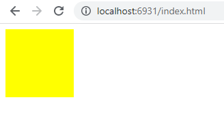

# Welcome to wasm_hello_world_c_dlopen

Back to [home](../readme.md)


There are three examples in this directory.

* **index.html** and **index.js** run wasm with webgl in a browser.
* **wasmwebgl.js** runs was with webgl in a native window using nodejs plus webgl-raub and glfw-raub
* **nodewebgl.js** runs a simple example of webgl in a native window using nodejs plus webgl-raub and glfw-raub

The browser version is based in this [blog](https://blog.feather.systems/WebGL.html), also found in [Github](https://github.com/AO-Design-Inc/webGL-with-emscripten).

In order to create wasm, it needs [Emscripten SDK (emsdk)](../readme.md#Installing-the-C-Emscripten-SDK)

After emsdk is installed, in order to use it, activate PATH and other environment variables in the current terminal:

```bash
source ../../../emsdk/emsdk_env.sh
```

## WASM file creation and execution

In the terminal, run the following command to compile src/main.c:

```bash
emcc src/main.c -o index.js
```
This will create **index.js** and **index.wasm**.

To test the example, it is necessary to run a server and open it in a browser, e.g.:

```bash
emrun index.html
```

Address e.g.: http://localhost:6931/index.html

This will produce the js file that will be used in the provided html file. The html file can be opened and viewed in any browser.



## nodewebgl.js

This simple example does not use wasm, it uses only pure javascript in nodejs with webgl. But it is the base to test if the native window with webgl is working.
It depends on webgl-raub and glfw-raub.

```bash
npm i webgl-raub

npm i glfw-raub

node nodewebgl.js
```

## wasmwebgl.js

It depends also on webgl-raub and glfw-raub.

Create a copy of nodewebgl.js and call it wasmwebgl.js

It is needed to add this code in the begining of the wasmwebgl.js file.

```javascript
const webgl = require('webgl-raub');
const { Document } = require('glfw-raub');
Document.setWebgl(webgl);
const document = new Document();
const requestAnimationFrame = document.requestAnimationFrame;
const mycanvas = document.createElement('canvas');
const myctx = mycanvas.getContext('webgl');

```

And replace in the code ```var canvas = findCanvasEventTarget(target);``` by ```var canvas = mycanvas;```

And ```var ctx = (canvas.getContext("webgl", webGLContextAttributes)``` by ```var ctx = myctx;```.

Execute it:

```bash
node wasmwebgl.js
```